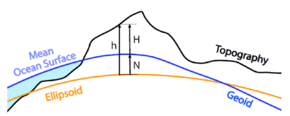
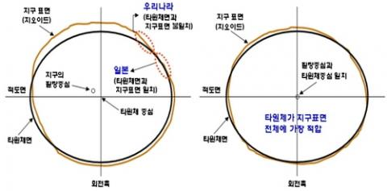
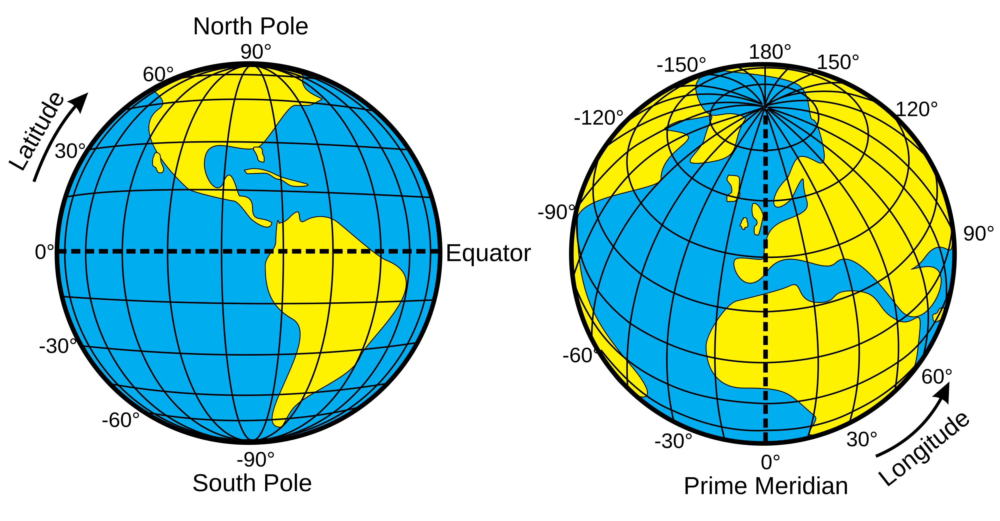
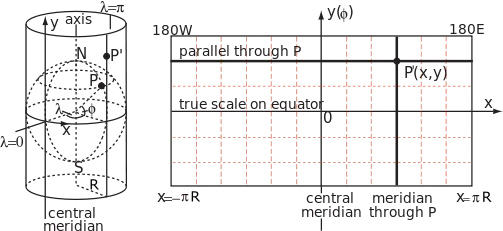
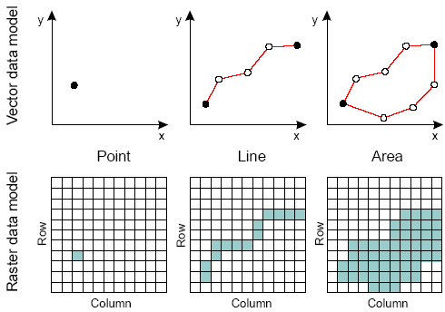

# 2026년 국립문화유산연구원 발굴캠프 - GIS의 개념과 기초 분석 실습

> **강의 목표**: GIS(Geographic Information Systems)의 기본 개념을 이해하고, QGIS를 활용하여 기초적인 분석을 수행해봅니다.

## 1. GIS?

### 1.1. 지리정보시스템

`GIS`는 지리적 공간 위치를 기반으로 다양한 데이터를 분석, 시각화하는 시스템입니다. 고고학에서는 유적의 입지, 유물 산포지, 지형과의 상관관계를 분석하고 과거 인간의 공간적 행위를 추론하는 핵심적인 도구로 활용됩니다. 대표적인 프로그램으로는 `QGIS`와 `ArcGIS` 등이 있습니다.

### 1.2. 기초 개념

#### 지오이드와 타원체?



`지오이드`는 지구 상에서 평균 해수면을 육지 내부까지 연장시킨 가상의 해수곡면을 의미합니다. 지구 내부의 밀도나 물질 분포가 균일하지 않기 때문에 중력의 크기와 방향이 위치마다 달라지며, 이로 인해 지오이드 표면은 실제 기하학적인 형태처럼 울퉁불퉁한 모양을 띱니다. 우리가 일상적으로 말하는 정밀한 높이(해발고도)를 측정할 때 고도 0m의 기준면이 되는 것이 바로 `지오이드`입니다.

`타원체`는 지구 표면이나 지오이드를 수학적으로 계산하고 지도화하기 위해 정의한 **기하학적 회전타원체**입니다. 지구는 자전으로 인한 원심력 때문에 적도 반지름이 극 반지름보다 약간 더 긴 편평한 모양을 하고 있습니다. `WGS84`나 `GRS80`가 대표적입니다.

#### 측지계?



`측지계(Datum)`은 타원체를 실제 지구의 특정 위치와 결합하여 공간 좌표의 기준을 정의하는 시스템입니다. 타원체를 지구 중심에 맞추는지(세계측지계), 아니면 특정 국가나 지역에 밀착시키는지(지역측지계)에 따라 동일한 위·경도 값이라도 실제 지표면상의 위치가 수백 미터 이상 달라질 수 있습니다. 따라서 고고학이나 지리 정보 데이터의 오차를 방지하고 정확하게 중첩하기 위해서는 어떤 데이텀을 기반으로 구축된 데이터인지 명확히 정의해야 합니다.

#### 좌표계

`좌표계`는 지표면 위의 특정 위치를 정량적인 수치로 표현하기 위해 사용하는 체계입니다. 기준이 되는 원점, 축의 방향, 그리고 단위를 정의함으로써 지구상의 모든 공간 객체에 고유한 위치 값을 부여합니다. GIS를 통해 공간 데이터를 올바른 위치에 매핑하고, 서로 다른 데이터 간의 관계를 분석하기 위해서는 반드시 통일된 좌표계가 사용되어야 합니다.

##### 지리좌표계



`지리좌표계`는 3차원 곡면인 지구 타원체 상의 위치를 회전 각도인 `위도(Latitude)`와 `경도(Longitude)`를 사용하여 표현하는 좌표계입니다. 적도와 본초자오선을 기준으로 평면 각도를 측정하며, 단위는 주로 `도·분·초(DMS)`나 `십진수 도(Decimal Degrees)`를 사용합니다. 전 지구적인 위치를 왜곡 없이 직관적으로 표현하는 데 유용하지만, 고정된 선형 단위(m, km 등)를 쓰지 않기 때문에 면적이나 거리를 즉각적으로 계산하기 어렵다는 특징이 있습니다.

##### 투영좌표계

`투영좌표계`는 3차원 곡면의 지리좌표계를 수학적 계산을 통해 2차원 평면으로 펼쳐서 표현한 좌표계입니다. 평면 상에서 위치를 나타내기 위해 `X`, `Y` 형태의 직교좌표(Grid) 체계를 채택하며, 미터(m)나 피트(ft) 같은 선형 단위를 사용하여 거리, 방향, 면적을 왜곡 없이 혹은 최소한의 왜곡으로 정밀하게 측정할 수 있도록 돕습니다.



- `투영법 (Projection Method)` : 투영법은 둥근 지구 표면의 지리적 정보를 평면 지도에 옮기는 기하학적·수학적 방법을 말합니다. 구체를 평면으로 펼칠 때는 각도, 면적, 거리, 방향 중 어느 하나 이상의 왜곡이 반드시 발생하므로, 지도의 활용 목적과 대상 지역의 위치에 따라 왜곡을 최소화할 수 있는 적절한 투영 방식을 선택해야 합니다.

    - `TM (Transverse Mercator)` : TM 투영법(횡단 메르카토르 투영법)은 가로로 눕힌 원통을 지구 타원체에 접하게 하여 투영하는 방식입니다. 횡원통 중심선(중앙 자오선)을 따라 남북 방향으로는 왜곡이 거의 발생하지 않아 매우 정확하지만, 동서 방향으로 멀어질수록 왜곡이 급격히 커지는 특성이 있습니다. 이 때문에 남북으로 좁고 긴 지형을 가진 지역의 고정밀 지도를 제작하거나 지적 측량 등을 수행할 때 표준 좌표계의 기초로 널리 활용됩니다.

    - `UTM (Universal Transverse Mercator)` : UTM 투영법은 TM 투영법의 원리를 전 지구적으로 확장하여 규격화한 좌표계입니다. 전 세계를 경도 6도 간격으로 60개의 종대(Zone) 구역으로 나누고, 각 구역마다 별도의 TM 투영을 적용하여 지구 전체의 왜곡율을 일정 수준 이하로 통제하도록 설계되었습니다. 군사 지도, 국제 협력 프로젝트 등 광역 데이터의 위치 정보를 통일된 표준 규격으로 다룰 때 주로 사용됩니다.

## 2. 자료의 성격과 수집 방법

### 2.1. 공간 데이터의 종류

- **위치 데이터** : 대상물이 지표면 상에 존재하는 실제 좌표와 기하학적 형태를 표현하는 데이터입니다. 주로 위도와 경도, 혹은 평면직각좌표계상의 X, Y 좌표값을 기반으로 구성됩니다.

- **속성 데이터** : 지도상의 특정 위치나 기하학적 객체가 어떤 고유한 특성을 지니고 있는지를 설명해 주는 데이터입니다. 가령 지도상에 표시된 하나의 점(위치 데이터)이 특정 유적을 나타낸다면, 그 유적의 이름, 시대, 면적, 발굴 연도 등 내적 정보에 대한 상세한 내용이 모두 속성 데이터에 해당합니다. `GIS`에서는 이 속성 테이블을 위치 정보를 결합하여 분석을 실시합니다.

- **메타 데이터** : '데이터를 설명하기 위한 데이터'입니다. 이를 통해 해당 데이터가 언제, 누구에 의해, 어떤 목적과 기준에 따라 구축되었는지를 파악할 수 있습니다. 데이터의 원천 출처, 제작 및 최신 갱신 일자, 적용된 좌표계(CRS)와 데이텀, 측량 오차 범위 및 해상도, 저작권 등의 배경 정보를 상세히 기록함으로써, 연구자나 사용자가 해당 데이터를 실제 분석에 활용하기 전에 그 신뢰성과 목적 부합하는지를 판단할 수 있도록 돕습니다.

### 2.2. 공간 데이터의 유형



- **벡터 데이터** : 불연속적인 지형지물을 점(Point), 선(Line), 면(Polygon)과 같은 기하학적 형태로 표현하는 데이터 유형입니다. 개별 객체는 정확한 좌표값(X, Y)을 바탕으로 위치와 형상이 정의되며, 유적의 좌표, 도로 및 하천망, 행정구역, 발굴 구역의 경계처럼 명확한 형태와 면적을 가지는 요소를 나타낼 때 주로 사용됩니다.

- **래스터 데이터** : 래스터 데이터는 지도상의 전체 공간을 일정한 크기의 정사각형 격자(Pixel)로 촘촘하게 분할하고, 각각의 격자마다 정보(고도, 온도 등)를 부여하여 연속적인 지표면의 상태를 표현하는 데이터 유형입니다. 격자 하나가 나타내는 실제 지표면의 크기가 곧 데이터의 해상도를 결정하며, 위성 영상, 항공 사진, 수치표고모델(DEM), 커널밀도분석(KDE) 결과물처럼 뚜렷한 경계선 없이 공간상에서 점진적으로 변화하는 자연 현상이나 연속적인 표면 데이터를 다룰 때 활용됩니다.

### 2.3. 자료 수집

#### 기초 자료 수집
GIS 분석을 실시하기 위해서는 연구 대상 지역의 기본 환경을 파악할 수 있는 지적도, 위성 영상, 수치표고모델(DEM) 등의 배경 지도가 필수적입니다. 이러한 기초 공간 데이터들은 대부분 국가 기관이나 공공 단체에서 체계적으로 구축하여 무료로 서비스하고 있으며, 연구의 편의성을 높이기 위해 본인이 자주 사용하는 지역의 데이터를 미리 가공하여 별도로 저장해 두는 것을 권장합니다. 필요한 공간 정보는 다음과 같은 국내외 공공 데이터 플랫폼을 통해 쉽게 확보할 수 있습니다.

- **공공데이터포털(https://www.data.go.kr/)**: 국가에서 개방하는 모든 공공데이터가 집약된 포털로, 다양한 행정 경계 데이터와 속성 정보가 결합된 공간 데이터를 제공

- **브이월드(https://www.vworld.kr/v4po_main.do)**: 3D 공간정보, 정사영상, 연속지적도 등 국가 기본 공간정보 공개

- **통계지리정보서비스(https://sgis.mods.go.kr/view/index)**: 인구, 주택, 사업체 등의 통계 자료를 지리 공간 정보와 결합하여 제공

- **토지이음(https://www.eum.go.kr/web/am/amMain.jsp)**: 토지 이용 계획, 도시계획시설, 지적도 등 부동산 및 국토 관리와 관련된 상세한 도면과 정보를 제공

- **NASA Open Data Portal(https://data.nasa.gov/)**: 전 지구적 규모의 기후, 위성 영상, 지형 고도(DEM) 등 광범위하고 정밀한 글로벌 공간 데이터를 확보할 때 유용

- **Database of Global Administrative Areas, GADM(https://gadm.org/)**: 전 세계 모든 국가의 행정 구역(시, 도, 군 등) 경계를 벡터 데이터로 제공

이외에도 다양한 경로를 통해 연구 목적에 맞는 데이터를 탐색할 수 있습니다

#### 고고학 자료 수집

고고학 자료 데이터는 주로 발굴조사보고서나 학술 논문의 부록에 수록되고 있습니다. 그러나 조사의 누적에 따라 다루어야하는 자료가 많아지고, 최근 정밀 측량 데이터, 방사성탄소연대측정치 등 수집되는 성격도 다양해져서 이를 지면에 인쇄하여 제공하는 방식이 점차 어려워지고 있습니다.

최근에는 분석에 사용된 원시 데이터(Raw data)나 코드를 GitHub, Google Drive, 혹은 학술 전용 리포지토리에 첨부하여 공유하는 사례가 증가하고 있습니다. 특히 해외 고고학계나 데이터 중심의 최신 연구에서는 연구의 재현성 확보를 위해 이러한 데이터를 필수적으로 공유하도록 하고 있으므로 잘 찾아보면 원하는 자료를 편하게 확보할 수 있습니다.

그럼에도 불구하고 '고고학적 맥락(Context)'은 여전히 발굴조사보고서에 가장 구체적이고 상세하게 기술되어 있기에 반드시 확인이 필요합니다. 어떤 자료든 기계적으로 추출된 데이터만을 맹신해서는 안 됩니다. 분석 결과가 지니는 고고학적 의미를 해석하고 데이터의 오류나 편향을 검증하기 위해서는 반드시 해당 보고서를 꼼꼼하게 교차 검토하는 과정이 수반되어야 합니다.

### 2.4. 프로젝트 관리

프로젝트 폴더를 체계적으로 구조화하는 것은 단순히 파일을 보기 좋게 정돈하는 것을 넘어, 연구자 스스로 전체 분석 흐름을 명확히 이해하고 통제하기 위한 핵심 과정입니다. 특히 후술할 AI Agent를 활용할 경우, 직관적이고 일관된 폴더 구조는 AI가 전체 프로젝트의 맥락을 파악하고 정확한 작업을 수행하는 것의 가이드라인이 됩니다. 프로젝트 구조의 경우 단 하나의 정답은 없지만, 타 연구자나 자신이 보았을 때 데이터의 성격과 분석 단계를 직관적으로 이해할 수 있도록 구성해야 합니다.

`Project/` : QGIS 프로젝트 파일(.qgz)을 저장하는 공간입니다. QGIS 프로젝트는 데이터 자체를 포함하는 것이 아니라 파일의 '경로'를 기억하여 불러오기 때문에, 여러 공간 데이터 파일들과 함께 최상위 폴더 하나에 묶어서 관리해야 추후 경로 오류 없이 프로젝트 전체를 백업하거나 이동시키기 용이합니다.

`Source/` : 분석의 배경이나 기초가 되는 원본 공간 데이터를 저장합니다.

- `Vector/` : Shapefile(.shp), GeoJSON 등 점, 선, 면으로 구성된 벡터 데이터를 보관합니다.

- `Raster/` : 수치표고모델(DEM), 정사영상, 배경 위성사진 등 픽셀 격자 형태의 래스터 데이터를 보관합니다.

`Tables/` : 고고학적 속성 정보가 담긴 데이터를 모아두는 곳입니다. 고고학적 정보 등이 정리된 `.xlsx` 파일이나 `.csv` 파일을 저장하여 관리합니다.

`Results/` : 다양한 분석을 통해 도출된 최종 결과물을 별도로 저장하여 원본 데이터와의 혼재를 방지합니다.

## 3. QGIS 설치 및 기초 실습

### 3.1. 설치

1. [QGIS 홈페이지](https://www.qgis.org/) 접속

2. `DOWNLOAD` 클릭

3. `Skip it and go to download` 클릭

4. 운영체제에 따라 알맞는 설치 파일 다운로드(`Long Term Release` 권장)

5. 설치 파일 실행 후 설치

### 3.2. 인터페이스 소개

처음 QGIS를 실행하게 되면 아래와 같은 화면으로 구성되어 있습니다.

- **브라우저 패널**: 컴퓨터 내의 파일 탐색

- **레이어 패널**: 현재 프로젝트에 추가된 데이터의 순서와 시각화를 관리

- **지도 캔버스**: 메인 작업 공간

- **툴 패널**: 분석 기능들이 정리된 패널

### 3.3. 데이터 불러오기

#### 벡터 데이터

#### 래스터 데이터

#### 정리된 테이블 데이터(**.csv**)

### 3.4. 좌표계 변환

#### 벡터 데이터
1. `Vector` 클릭

2. `Data Managements Tool` 클릭

3. `레이어 재투영` 클릭 후 아래의 정보 입력
    - 입력 레이어
    - 대상 좌표계
    - 재투영된 산출물

4. `실행`

#### 래스터 데이터
1. `Raster` 클릭

2. `Projections` 클릭

3. `왜곡(재투영 ...)` 클릭 후 아래의 정보 입력
    - 입력 레이어 : 재투영 대상
    - 소스 좌표계 : 원본 좌표계 선택
    - 대상 좌표계 : 원하는 좌표계 선택
    - 재투영된 산출물 : 재투영된 결과물의 저장 위치

4. `실행`

## 4. 유적분포도 그리기

## 5. 커널밀도추정

## 6. 조판

지도

범례

방위표


## 7. AI Agent를 통한 QGIS 분석

### 7.1. MCP란?

`MCP(Model Context Protocol)`는 AI Agent가 다양한 프로그램, 네트워크 등과 연결될 수 있도록 해주는 오픈소스 프로토콜입니다. 기존에는 AI가 데이터 저장소나 프로그램에 접근하려면 각각의 연결 코드를 작성해야 했지만, MCP는 이를 단일 규격으로 통일한 것입니다. 즉, AI Agent와 외부 환경을 이어주는 다리 역할을 수행하며, AI를 통해 직접 여러 프로그램 상에서 작업할 수 있게 해줍니다.

### 7.2. QGIS MCP Plugin 설치

가장 먼저 QGIS와 AI Agent를 MCP로 연결해주는 플러그인을 설치합니다.

1. QGIS → `플러그인` → → `플러그인 관리 및 설치` 클릭

2. `QGIS MCP` 검색 후 설치

3. `Open configurator` 클릭 → `6.5. MCP 연결`로 이동

### 7.3. UV 설치

`UV`는 python 프로젝트 및 패키지 관리 도구로 이를 활용하여 `MCP`를 간편하게 불러올 수 있습니다.

#### MacOS
``` bash
curl -LsSF https://astral.sh/uv/install.sh | sh

혹은

brew install uv
```

#### Windows
``` Powershell
powershell -ExecutionPolicy ByPass -c "irm https://astral.sh/uv/install.ps1 | iex"
```
### 7.4. AI Agent 설치

AI Agent는 주어진 목표를 달성하기 위해 스스로 환경을 인지하고 계획을 세워 직접 작업을 수행하는 인공지능 시스템입니다. 다양한 작업이 가능하며, 상용 프로그램을 연결해서 작업하는 것도 가능합니다. 최근 개발에 활용되는 AI Agent는 사용자를 대신해 파일 시스템을 제어하거나 직접적인 코딩을 수행합니다. 그리고 이러한 복잡한 작업 과정과 결과물을 사용자에게 효과적으로 전달하기 위해 TUI(Text/Terminal User Interface) 형태로 제공되는 것이 특징입니다.

코딩 작업에서 일반적인 LLM 대신 Agent를 활용하는 이유는 **맥락의 이해**과 **직접적인 실행 능력** 때문입니다. 일반적인 챗봇 형태의 LLM을 활용하는 작업이 단편적인 코드를 생성하는 것에 그친다면, 에이전트는 직접적인 수행 권한을 부여받아 프로젝트의 전반적인 구조를 이해하고 결과물을 직접적으로 생성하며, 에러가 발생할 경우 스스로 로그를 분석해 해결책을 적용합니다.

***TUI: 텍스트 문자와 키보드 입력만으로 컴퓨터 프로그램과 상호작용하는 화면 환경. AI 에이전트의 추론 과정이나 시스템의 실행 상태를 직관적으로 이해하는 것에 용이**

AI Agent는 터미널 환경을 통해 간단히 설치할 수 있습니다. 운영체제별 터미널 접속 방법은 아래를 참고해주세요.

- MacOS & Linux: `Command(⌘)` + `Spacebar` 누르기 → 터미널(Terminal) 검색 후 실행
- Windows: `Win(⊞)` + `X` 누르기 → 터미널(관리자) 클릭

터미널을 실행하셨다면 본인이 현재 구독하고 있는 유료 AI 서비스에 따라서 AI Agent 설치를 진행해주세요. 각 제품별 설치 명령어는 아래와 같습니다.

#### Claude Code (Anthropic)

##### - MacOS & Linux
Mac 또는 Linux에서 `Claude Code`를 설치하려면 아래의 명령을 실행하세요.
``` bash
curl -fsSL https://claude.ai/install.sh | bash
```

##### - Windows
Windows에서 `Claude Code`를 설치하려면 아래의 명령을 실행하세요.
``` powershell 
irm https://claude.ai/install.ps1 | iex
```
#### Antigravity CLI (Google)
*기존에는 `Gemini CLI`가 있었으나, 2026년 6월 18일에 서비스가 종료되었고 `Antigravity CLI`로 일원화 되었습니다.
##### - MacOS & Linux
Mac 또는 Linux에서 `Antigravity CLI`를 설치하려면 아래의 명령을 실행하세요.
``` bash
curl -fsSL https://antigravity.google/cli/install.sh | bash
```

##### - Windows
Windows에서 Antigravity CLI를 설치하려면 아래의 명령을 실행하세요.
``` powershell 
irm https://antigravity.google/cli/install.ps1 | iex
```

#### Codex CLI (OpenAI)
##### - MacOS & Linux
Mac 또는 Linux에서 `Codex CLI`를 설치하려면 아래의 명령을 실행하세요.
``` bash
curl -fsSL https://chatgpt.com/codex/install.sh | sh
```

##### - Windows
Windows에서 `Codex CLI`를 설치하려면 아래의 명령을 실행하세요.
``` powershell 
powershell -ExecutionPolicy ByPass -c "irm https://chatgpt.com/codex/install.ps1 | iex"
```

#### 7.5. MCP 연결

본인이 구독하고 있는 AI 유료 서비스에 따라서 아래의 절차를 수행하세요.

##### Claude Code

터미널 환경에서 아래의 명령어를 입력하세요.

``` bash
claude mcp add qgis -- uvx --from "https://github.com/nkarasiak/qgis-mcp/archive/refs/heads/main.zip" qgis-mcp-server
```
##### Antigravity CLI

##### - MacOS

    1. `Finder` 열기

    2. `Cmd` + `Shift` + `G` 입력

    3. `~/.gemini` 혹은 `~/.antigravity` 입력

    4. `mcp_config.json` 파일에 아래의 내용 저장(없을 경우 생성)

##### - Windows

    1. `파일 탐색기` 열기

    2. 주소창을 클릭

    3. `C:\Users\user\.gemini\antigravity-cli` (또는 `C:\Users\user\.antigravity\antigravity-cli`)를 입력

    4. `mcp_config.json` 파일에 아래의 내용 저장(없을 경우 생성)

``` JSON
"mcpServers": {
    "qgis": {
      "command": "uvx",
      "args": [
        "--from",
        "https://github.com/nkarasiak/qgis-mcp/archive/refs/heads/main.zip",
        "qgis-mcp-server"
      ]
    }
  }
```

    5. 플러그인 → QGIS MCP → RUN MCP 클릭

    6. AI Agent 내에서 `/mcp` 입력 → QGIS 연결 확인

##### Codex CLI

터미널 환경에서 아래의 명령어를 입력하세요.

``` bash
codex mcp add qgis -- uvx --from "https://github.com/nkarasiak/qgis-mcp/archive/refs/heads/main.zip" qgis-mcp-server
```